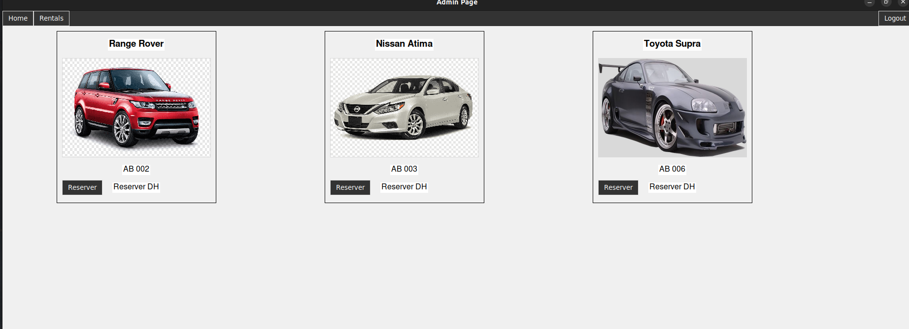

#   Developers 
      NAMOUS NASSIM   MAKOUDI KHALID  ADNANE IJJANE

# location-voiture
This is a simple car rental application built with Python and tkinter GUI toolkit. It allows users to browse available cars, view car details and prices, and reserve a car for a specific period of time. The app connects to a MySQL database to store car information and reservation details.

Technologies used:
- Python
- tkinter
- MySQL

Installation:
- Clone the repository
- Install required packages with `pip install -r requirements.txt`
- Configure the MySQL database credentials in the `config.ini` file

#   ScreenShots : 

.png)

#  Main_Page.py Documentation (Fr) :
    
        Ce code utilise le module Tkinter de Python pour créer une interface graphique d'une application de gestion de location de voitures. L'interface graphique est définie dans la classe Menu, qui crée une fenêtre principale avec deux boutons pour se connecter ou s'inscrire à l'application.

    Lorsqu'un utilisateur clique sur le bouton "Login" ou "Register", les méthodes show_login et show_register sont appelées respectivement. Ces méthodes détruisent la fenêtre principale actuelle (self.window.destroy()) et créent une nouvelle instance de la classe Login ou Register dans une nouvelle fenêtre. La nouvelle fenêtre est exécutée avec la méthode mainloop().

    La classe Login et la classe Register sont des classes séparées dans des fichiers distincts (Login_Page.py et Register_Page.py). Elles gèrent l'affichage des pages de connexion et d'inscription respectivement.

    Le code utilise également la classe Label pour afficher le nom de l'application et les crédits des développeurs. La classe PhotoImage est utilisée pour afficher le logo de la voiture dans la barre de titre de la fenêtre principale.

    En résumé, ce code crée une interface graphique pour une application de location de voitures avec des boutons de connexion et d'inscription et affiche le logo de l'application et les crédits des développeurs. Les pages de connexion et d'inscription sont gérées dans des classes séparées.
    

 # Login_Page.py (Documentation (FR)) : 

    La classe "Login" permet de créer une interface graphique pour la connexion à une application de gestion de location de voitures.

Les packages tkinter et ttk sont importés pour construire l'interface graphique et afficher les messages d'erreur ou d'information.

La méthode init() est appelée lors de la création de l'objet. Elle initialise la fenêtre principale en définissant ses dimensions, son titre, sa non-redimensionnabilité et sa couleur de fond. Elle configure également le style des éléments de l'interface graphique tels que les étiquettes, les entrées et les boutons.

Ensuite, des widgets tels que les étiquettes "Titre", "Nom d'utilisateur" et "Mot de passe", les entrées pour saisir les identifiants de connexion, ainsi que les boutons "Se connecter" et "Retour" sont ajoutés à la fenêtre principale à l'aide de la méthode place().

La méthode login() est appelée lorsque le bouton "Se connecter" est cliqué. Elle récupère les valeurs saisies dans les champs de nom d'utilisateur et de mot de passe et vérifie si l'un ou l'autre est vide. Si c'est le cas, un message d'erreur est affiché en utilisant la boîte de dialogue messagebox. Si les champs sont remplis, une requête SQL est envoyée à la base de données pour vérifier si les identifiants de connexion sont valides. Si la requête renvoie une réponse positive, un message d'information est affiché et la fenêtre de connexion est détruite, laissant place à la page d'accueil de l'application. Dans le cas contraire, un message d'erreur est affiché.

La méthode back() est appelée lorsque le bouton "Retour" est cliqué. Elle détruit la fenêtre de connexion et affiche la page de menu principal de l'application.

Enfin, si la classe est exécutée directement, elle crée une instance de la classe Login et lance la boucle principale de la fenêtre Tkinter.

#   Register_Page.py (Documentation (FR)): 

     permet à un utilisateur de s'inscrire dans une base de données en utilisant Tkinter. Voici une description de chaque partie du code:

Ligne 1 : Importation du module tkinter.

Ligne 2 : Importation des modules ttk et messagebox à partir de tkinter.

Ligne 3 : Importation de la classe Connection du module Database.

Ligne 6-23 : Définition de la classe Register qui contient toutes les fonctionnalités nécessaires pour permettre à un utilisateur de s'inscrire dans la base de données.

Ligne 8-15 : Initialisation de la fenêtre principale et de toutes les variables nécessaires à l'affichage.

Ligne 17-21 : Configuration de la police de caractères, des couleurs et des styles des éléments d'interface utilisateur.

Ligne 23-30 : Définition des étiquettes et des champs d'entrée nécessaires pour l'inscription de l'utilisateur.

Ligne 32-38 : Définition des boutons nécessaires pour l'inscription de l'utilisateur.

Ligne 40-46 : Définition de la méthode back qui permet de fermer la fenêtre de l'application et de revenir à la page principale.

Ligne 48-62 : Définition de la méthode register qui permet de vérifier si toutes les informations nécessaires ont été saisies, de vérifier que le mot de passe est identique à la confirmation du mot de passe, et d'enregistrer les informations de l'utilisateur dans la base de données.

Ligne 64-68 : Initialisation de la fenêtre principale Tkinter, de la classe Register et de la boucle principale de l'application.

En somme, cette application permet à un utilisateur de s'inscrire dans une base de données en utilisant Tkinter. Les champs d'entrée et les boutons ont été configurés pour permettre une utilisation facile et intuitive de l'application.

# Admin_Page.py (Docuemntation (Fr)): 

e code est une application graphique pour une agence de location de voitures, développée en Python à l'aide du module Tkinter. L'application est divisée en deux classes principales :

    CarCard : une sous-classe de tk.Frame qui représente une carte pour une voiture individuelle. Les instances de cette classe sont créées pour chaque voiture stockée dans la base de données et sont ajoutées à la fenêtre principale. Les cartes contiennent des informations sur la voiture telles que son modèle, sa plaque d'immatriculation, son image et son prix. Chaque carte a également un bouton "Réserver" qui permet de réserver la voiture.
    HomePage : une sous-classe de tk.Tk qui représente la fenêtre principale de l'application. Elle contient un en-tête, un conteneur pour les cartes de voiture et des boutons pour naviguer entre différentes sections de l'application. Les boutons "Home" et "Rentals" permettent respectivement de charger toutes les voitures et les voitures réservées. Le bouton "Logout" permet de se déconnecter de l'application.

En outre, la base de données est gérée à l'aide d'un module externe appelé Database. La classe Connection de ce module est utilisée pour interagir avec la base de données et exécuter les requêtes nécessaires pour charger les voitures et les voitures réservées.

Le code utilise également les modules PIL (Python Imaging Library) et messagebox de Tkinter pour gérer les images de voiture et afficher des messages d'information.

# Database.py (Documentation (FR)) : 
Ce code est une classe permettant de se connecter à une base de données MySQL et d'exécuter des requêtes SQL spécifiques à un service de location de voitures. Voici une explication détaillée :

Importations :

    mysql.connector : une bibliothèque pour la connexion à des bases de données MySQL
    configparser : une bibliothèque pour lire des fichiers de configuration INI

Class Connection :

    Cette classe initialise une connexion à la base de données MySQL à l'aide des informations de connexion stockées dans un fichier de configuration.
    La méthode enter renvoie un curseur pour la connexion. Cette méthode est utilisée en conjonction avec la méthode "with" pour ouvrir automatiquement et fermer proprement la connexion.
    La méthode exit ferme proprement la connexion et exécute une validation si nécessaire.

Méthode get_all_cars() :

    Cette méthode exécute une requête SQL pour récupérer toutes les voitures non réservées de la base de données.
    Elle renvoie tous les résultats sous forme de liste de tuples.

Méthode get_car_price(matricule) :

    Cette méthode exécute une requête SQL pour récupérer le prix par jour d'une voiture spécifique.
    Elle prend le paramètre matricule pour spécifier la voiture recherchée.
    Elle renvoie le résultat unique sous forme de float ou None si la requête ne renvoie aucun résultat.

Méthode get_reserved_cars() :

    Cette méthode exécute une requête SQL pour récupérer toutes les voitures réservées de la base de données.
    Elle renvoie tous les résultats sous forme de liste de tuples.

Méthode set_car_reserved(matricule) :

    Cette méthode exécute une requête SQL pour marquer une voiture comme réservée dans la base de données.
    Elle prend le paramètre matricule pour spécifier la voiture à marquer.
